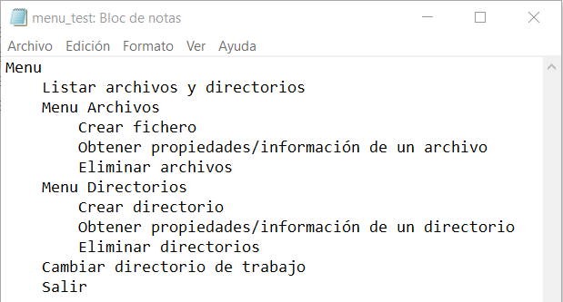
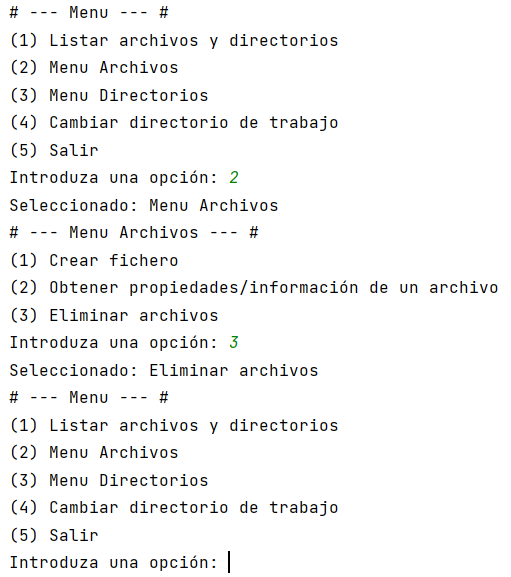
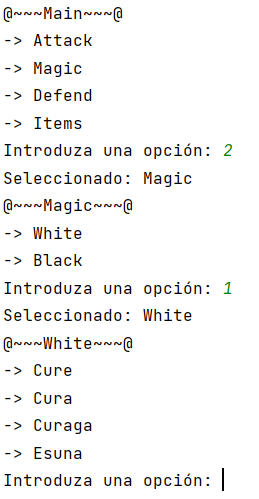
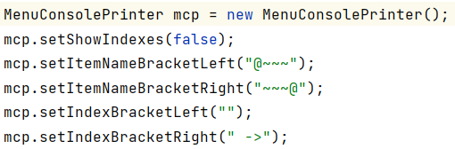

# Menu de opciones jerárquico

Autor: Sergio Martí Torregrosa

Fecha: 22/11/2023

Version: 1.0

## Descripción

Una situación muy común cuando se está comenzando a programar, o cuando se trabaja como programador, es la necesidad de 
crear de un menú de opciones. 

Esta tarea es fácil de solucionar en casos sencillos, pero puede complicarse cuando se necesita un menú con muchas 
opciones o submenús, e implica que el programador pierda el tiempo implementado toda la lógica que hay detrás.
Esto puede volver el programa innecesariamente complejo, largo y poco mantenible en el tiempo, aparte de ser repetitivo. 

Este proyecto propone una solución para crear y gestionar menús de opciones fáciles de usar, tanto para el usuario como 
para el programador, ahorrando varias líneas de código. Proporciona una estructura **flexible** y **robusta**, 
altamente **configurable**, para adaptarse a muchas situaciones diferentes.

La finalidad del proyecto es encapsular la lógica de los menús, permitiendo a los desarrolladores incorporar de manera 
eficiente sistemas de navegación jerárquica (los menús pueden contener submenús) en sus programas.

### Características

- Estructura flexible y robusta. Las clases pueden reutilizarse y extenderse para adecuarse a sus necesidades.
- Creación de menús de opciones de forma rápida, al inicio del programa o en ejecución.
- Encapsulamiento de la lógica para recorrer menús de opciones jerárquicos. 
- Herramientas para solicitar al usuario diferentes *inputs* por consola.
- Lectura y guardado en archivos con diferentes extensiones: .txt, .xml y en un futuro .json.
- El programador puede elegir entre diferentes métodos de lectura de archivos para ahorrar memoria.
- Mostrar en consola los menús de opciones, pudiendo configurar la apariencia.
 
Se han tratado de seguir los principios de buenas prácticas en programación para favorecer la máxima reutilización 
del código.

Inspirado en: [Programming a Retro Pop-Up Menu System](https://github.com/OneLoneCoder/Javidx9/blob/master/PixelGameEngine/SmallerProjects/OneLoneCoder_PGE_RetroMenu.cpp)

## Contenido

Las clases principales del repositorio son las siguientes:

### Lógica interna

- **MenuItem**: representa un item simple del menú; una de las opciones. Contiene un identificador (*id*) y un nombre 
  (*name*), que es el que se muestra en el menú. Puede contener hijos, es decir, submenús. Por lo tanto, es un objeto 
  con una estructura de árbol, recursiva.
    
- **MenuManager**: es el gestor del menú. Gestiona una instancia de *MenuItem* para poder recorrer la estructura de árbol. 
  Por ejemplo, se puede recorrer el menú desde el elemento padre, a un elemento hijo, y después volver al padre.

### Persistencia de datos

Los menús se pueden guardar como archivos *txt* o *xml*.

#### Texto plano

Los archivos de texto plano estructuran la información jerárquica en base a la identación, como se muestra en la imagen:



Esto permite crear menús de una forma muy rápida y sencilla.

- **MenuItemReaderText**: esta clase contiene los métodos para leer un archivo de texto plano con la información de las 
  opciones de un menú.
  
- **MenuItemWriterText**: esta clase contiene los métodos para escribir la información de las opciones de un menú en un 
  archivo de texto plano. Se puede configurar para qué la escritura del archivo utilice recursividad o no. El resultado 
  es el mismo, pero cambia la velocidad de lectura y el uso de memoria.

#### XML

- **MenuItemWriterXml**: esta clase sirve para guardar una instancia de *MenuItem* como un archivo *xml*.

- **MenuItemReaderXmlDOM**: esta clase sirve para leer un archivo *xml* que contiene la información de un *MenuItem*, y 
  construir una instancia con esta información. Utiliza la tecnología de *DOM parser* (DOM son las siglas de 
  *Document Object Model*), es decir, que carga toda la información del archivo *xml* en memoria.
  
- **MenuItemReaderXmlSAX**: esta clase sirve para leer un archivo *xml* que contiene la información de un *MenuItem*, y
  construir una instancia con esta información. Utiliza la tecnología de *SAX parser*, la cual gestiona más 
  eficientemente la memoria.
  
### Consola

El módulo del proyecto "java-menú-item-console" contiene las clases para poder mostrar en consola las opciones y que el 
usuario pueda interactuar con el menú de forma sencilla.

Se puede personalizar la forma de mostrar por pantalla el menú contando con diferentes opciones.

- **MenuConsolePrinter**: renderiza y muestra por pantalla un *MenuItem*. También se le puede proporcionar un 
  *MenuManager*. Dispone de varias opciones de personalización.
  
- **UserInputConsoleUtils**: esta clase contiene una serie de utilidades para poder manejar las entradas de usuario 
  por consola.
  
- **MenuManagerConsole**: esta clase contiene el bucle necesario para mostrar las opciones de un menú por consola, 
  solicitar que el usuario que introduzca una opción y ejecuta la acción asociada. Las acciones se pueden
  añadir mediante el método "*addAction*", pasando por parámetro el "*id*" de la opción y una función lambda. Si el 
  programador prefiere implementar por su cuenta el código para gestionar las acciones, está disponible 
  la clase abstracta **AbstractMenuManagerConsole**.
  
Estas son algunas capturas.



La imagen anterior es el estilo por defecto. Este es otro menú con otro estilo.



Para el menú anterior, se configuró la instancia *MenuConsolePrinter* de la siguiente forma:



## Ejemplos

Estos ejemplos se pueden encontrar en el módulo "java-menu-test".

### Ejemplo 1

En este ejemplo se muestra el código para crear un programa que muestra un menú de opciones por consola.

```java
package org.ui.test;

import org.ui.console.printer.MenuConsolePrinter;
import org.ui.menu.MenuItem;
import org.ui.menu.MenuManager;
import org.ui.menu.io.xml.read.MenuItemReaderXmlDOM;
import org.xml.sax.SAXException;

import javax.xml.parsers.ParserConfigurationException;
import java.io.IOException;

import static org.ui.console.input.UserInputConsoleUtils.getUserInputIntBetweenBounds;

public class Example01 {

  static String filename = "C:\\Users\\Sergio\\IdeaProjects\\java-user-interface\\files\\menu_magic_test.xml";

  public static void main(String[] args) {
    MenuManager mm = new MenuManager(new MenuItemReaderXmlDOM().read(filename));

    MenuConsolePrinter mcp = new MenuConsolePrinter();

    MenuItem command;
    do {
      mcp.show(mm);
      System.out.print("Introduza una opción: ");
      command = mm.onConfirm(getUserInputIntBetweenBounds(0, mm.getPeekNumChildren()) - 1);
      System.out.println("Seleccionado: " + command.getName());
      if (!command.hasItems() && mm.getStack().size() > 1) {
        mm.getStack().pop();
      }
      // manageAction(command.getId()); # <- Implementar aquí la funcionalidad
    } while (command.getId() != -1);
  }

}
```

### Ejemplo 2

Otra posible implementación del ejemplo anterior que aún ahorra más líneas de código sería la siguiente:

```java
package org.ui.test;

import org.ui.console.MenuManagerConsole;
import org.ui.menu.io.xml.read.MenuItemReaderXmlDOM;
import org.xml.sax.SAXException;

import javax.xml.parsers.ParserConfigurationException;
import java.io.IOException;

public class Example02 {

    static String filename = "C:\\Users\\Sergio\\IdeaProjects\\java-user-interface\\files\\menu_magic_test.xml";

    public static void main(String[] args) throws ParserConfigurationException, IOException, SAXException {
        MenuManagerConsole mmc = new MenuManagerConsole(new MenuItemReaderXmlDOM().read(filename));
        
        // Implementar aquí las acciones de cada opción
        mmc.addAction(1, () -> System.out.println("hacer algo"));
        
        mmc.run();
    }
    
}
```

### Ejemplo 3

Aquí se demuestra una forma de crear programáticamente un menú de opciones:

```java
package org.ui.test;

import org.ui.console.MenuManagerConsole;
import org.ui.menu.MenuItem;

public class Example03 {

    public static void main(String[] args) {
        MenuItem mi = new MenuItem("Menu");
        mi.add("Listar archivos y directorios").setId(1);

        MenuItem fileMenu = mi.add("Menu Archivos").setId(2);
        fileMenu.add("Crear fichero").setId(3);
        fileMenu.add("Obtener propiedades/información de un archivo").setId(4);
        fileMenu.add("Eliminar archivos").setId(5);

        MenuItem dirMenu = mi.add("Menu Directorios").setId(6);
        dirMenu.add("Crear directorio").setId(7);
        dirMenu.add("Obtener propiedades/información de un directorio").setId(8);
        dirMenu.add("Eliminar directorios").setId(9);

        mi.add("Cambiar directorio de trabajo").setId(10);

        int lastId = 10;
        MenuItem extraMenu = mi.add("Menu extra!").setId(0);
        for (int i = 0; i < 10; i++) {
            int id = i + lastId;
            extraMenu.add(String.format("Opción extra %d", id)).setId(id);
        }

        mi.add("Salir").setId(-1);

        // Mostrar por consola
        MenuManagerConsole mmc = new MenuManagerConsole(mi);
        mmc.run();
    }

}
```

## Planes a futuro

En un futuro, se pretenden implementar las siguientes funcionalidades:

- Implementar funcionalidades para utilizar otras tecnologías para almacenar información. Por ejemplo: archivos *json*.
- Extender las funcionalidades de los items del menú (*MenuItem*). Por ejemplo: tablas, funciones, etc.
- Almacenar la información del estilo con que se muestra el menú en consola.
- Añadir una clase con algunos estilos predefinidos para mostrar el menú en consola.
- Implementar una forma de visualizar estos menús en una interfaz gráfica de JavaFX.